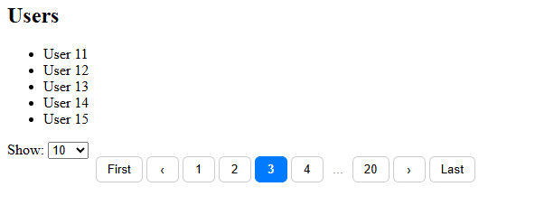

# ngx-pagination-andy

Komponen pagination untuk Angular dengan fitur terbaru.

## Fitur Terbaru di `pagination.component.ts`

- **Input Properti Baru**:  
   - `customOpt`: Array pilihan jumlah item per halaman [10,20,30,50].
   - `showSelector`: menampilkan pilihan jumlah per halaman.
   - `page`: Halaman yang aktif.
   - `totalItem`: Total item.

- **Output Event**:  
   - `pageChange`: Emit saat halaman berubah.

- **Optimasi Kinerja**:  
   - Render hanya tombol yang diperlukan.
   - Navigasi lebih responsif.
   
- **Isi paginator** :
  - page: 1,
  - limit: 10,
  - totalItem: 0,

## Cara Penggunaan

```typescript
<pagination
   [data]="paginator",
   [showSelector]="true"
   (pageChange)="onPageChange($event)">
</pagination>
```

## Instalasi

```bash
npm install ngx-pagination-andy
```

## Dokumentasi Lengkap

Lihat file `pagination.component.ts` untuk detail properti dan event terbaru.


## Contoh Gambar




## 📜 Lisensi
MIT © [EkaH]

# My Pagination Lib

[](LICENSE)